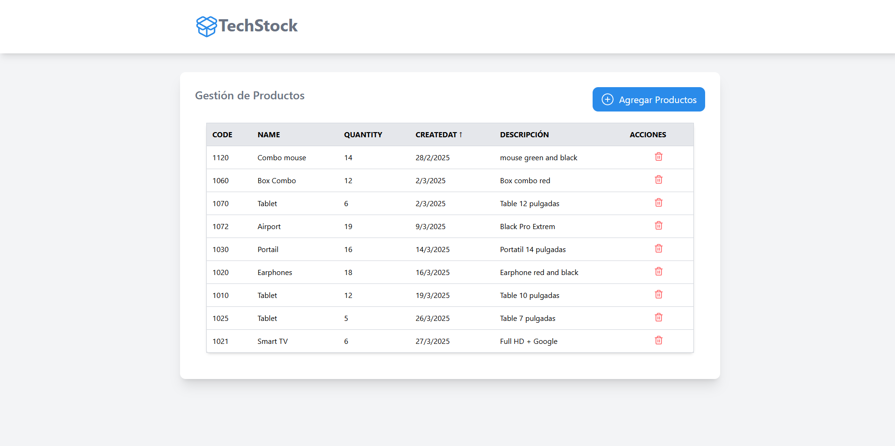
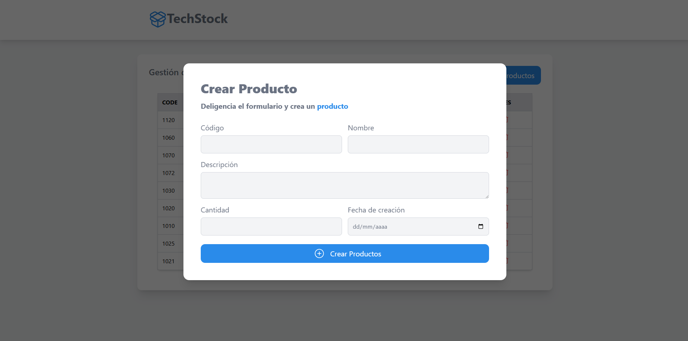

# 📦 TechStock - Gestión de Productos

TechStock es una aplicación web que permite gestionar productos, incluyendo la creación, visualización, filtrado y eliminación de los mismos.

## 🚀 Tecnologías utilizadas

- ⚛ **React 19** – Biblioteca para la construcción de interfaces.  
- 🌍 **Context API + useReducer** – Manejo global del estado de los productos.  
- 🛣 **React Router Dom** – Manejo de rutas dentro de la aplicación.  
- 🎣 **React Hook Form** – Manejo eficiente de formularios.  
- 🎨 **Tailwind CSS** – Estilos rápidos y modulares.  
- 🔥 **Lucide-react** – Íconos personalizables.  
- 🔔 **React Toastify** – Notificaciones visuales.  
- 💾 **LocalStorage** – Persistencia de datos en el navegador.  
- 🏎 **Vite** – Herramienta de desarrollo rápida.  

## 📌 Características

✅ **Gestión de productos** con los siguientes campos:
- **Código** (number)  
- **Nombre** (text)  
- **Descripción** (text)  
- **Cantidad** (number)  
- **Fecha de creación** (date)  

✅ **Visualización y administración**:
- Lista con todos los productos registrados.  
- Filtros y ordenamiento por **código, nombre, cantidad y fecha de creación**.  
- Eliminación de productos con actualización automática.  
- Persistencia en **localStorage**, evitando la pérdida de datos al recargar la página.  

✅ **Gestión del estado global con Context API y useReducer**:
- **Context API** permite compartir el estado entre componentes sin prop drilling.  
- **useReducer** se encarga de manejar las acciones de agregar, eliminar y filtrar productos de manera eficiente.  

## 🛠 Instalación y ejecución

### 1. Clona el repositorio:  

```sh
git clone https://github.com/afgomezv/techstock.git
cd techstock
```
### 2. Instalar dependencias
```sh
npm install
```

### 3. Ejecutar en desarrollo
```sh
npm run dev
```

## 📂 Estructura del proyecto

# 📂 Estructura del Proyecto

```plaintext
📦 techstock
 ┣ 📂 src
 ┃ ┣ 📂 context        # Manejo global del estado con Context API + useReducer
 ┃ ┣ 📂 components     # Componentes reutilizables (inputs, botones, listas)
 ┃ ┣ 📂 hooks          # Hooks personalizados (uso de localStorage, lógica compartida)
 ┃ ┣ 📂 layouts        # Componentes de diseño como Navbar, Sidebar, Footer
 ┃ ┣ 📂 reducers       # Reducers para gestionar el estado con useReducer
 ┃ ┣ 📂 types          # Definición de tipos y modelos con TypeScript
 ┃ ┣ 📂 views          # Páginas principales (Home, Create, List)
 ┃ ┣ 📜 router.tsx     # Punto de entrada de la app
 ┃ ┣ 📜 main.tsx       # Renderizado en el DOM
 ┃ ┗ 📜 index.css     # Estilos globales con Tailwind
 ┣ 📜 package.json
 ┣ 📜 README.md
 ┗ 📜 tsconfig.json
```

## 📷 Capturas de pantalla




## 🏗 Mejoras futuras
- Agregar autenticación para gestionar productos por usuario.

- Implementación de una API backend para sincronización remota.

- Mejoras en la UI/UX.
